# 🌱 HabitBloom — Interactive Habit Garden (Mobile Application)

## 📱 Overview

**HabitBloom** is a **mobile application** built using **React Native and Expo** that transforms habit tracking into an immersive and visually engaging experience.

Instead of traditional checklists, HabitBloom introduces a **gamified garden ecosystem**, where each completed habit contributes to the growth of a virtual plant — making productivity feel natural, rewarding, and enjoyable.

This project was developed as part of a **Mobile Application Development course**, showcasing modern mobile UI/UX, animations, and real-world integrations.

---

## 🎯 Objective

* Encourage **consistent habit formation**
* Use **visual gamification** to improve engagement
* Implement **real-time, interactive mobile UI features**

---

## ✨ Key Features

### 🌿 Habit Management

* Add, edit, and delete habits
* Clean and intuitive interface

### 🔥 Streak Tracking System

* Track daily progress and streak consistency
* Encourages long-term discipline

### 🌸 Interactive Garden-Based Tracking

* Habits are represented as growing plants
* Progress is visualized through a **garden ecosystem**
* Creates emotional connection with habit growth

---

### 🎬 Animations & Micro-Interactions

* Smooth transitions and animated components
* Visual feedback when completing habits
* Enhances user engagement and app feel

---

### 🌦️ Real-Time Weather Background

* Dynamic background changes based on **real-world weather conditions**
* Creates immersive and realistic user experience
* Environment reflects mood (sunny, rainy, etc.)

---

### 📊 Statistics Screen

* Dedicated **stats dashboard**
* Tracks:

  * Habit completion rates
  * Streak performance
  * Overall progress insights
* Helps users analyze and improve habits

---

### 💬 Motivational Quotes

* API-based dynamic quotes
* Encourages consistency and positivity

---

### 🎨 Theme Customization

* Light & Dark modes
* Personalized UI experience

---

### 📱 Mobile-First Design

* Fully optimized for mobile devices
* Smooth navigation using modern routing

---

## 🛠️ Tech Stack

| Category             | Technology Used            |
| -------------------- | -------------------------- |
| **Frontend**         | React Native (Expo)        |
| **State Management** | Redux                      |
| **Navigation**       | Expo Router                |
| **APIs**             | Quotes API + Weather API   |
| **UI/UX**            | Animations, LinearGradient |

---

## 🚀 Installation & Setup

### 1️⃣ Clone Repository

```bash
git clone https://github.com/neharehan2005/HabitBloom-Interactive-Habit-Garden-App.git
cd HabitBloom-Interactive-Habit-Garden-App
```

### 2️⃣ Install Dependencies

```bash
npm install
```

### 3️⃣ Run the App

```bash
npx expo start
```

### 4️⃣ Open App

* Press **`a`** → Android Emulator
* Press **`w`** → Web
* Scan QR → Physical device (Expo Go)

---

## 📲 Usage

1. Open the app
2. Add habits
3. Complete them daily
4. Watch your **garden grow 🌱**
5. Track progress in the **stats screen 📊**
6. Stay motivated with quotes and visuals

---

## 📁 Project Structure

```
HabitBloom/
├── app/               # Screens (Garden, Stats, Auth)
├── components/        # UI components & animations
├── store/             # Redux state management
├── assets/            # Images, icons, backgrounds
├── firebaseConfig.js  # Backend config
├── package.json
└── README.md
```
## 📱 App Preview (User Flow)

Below is the complete user journey of HabitBloom from authentication to habit tracking and analytics.

### 🔐 1. Authentication Flow


<p align="center">
  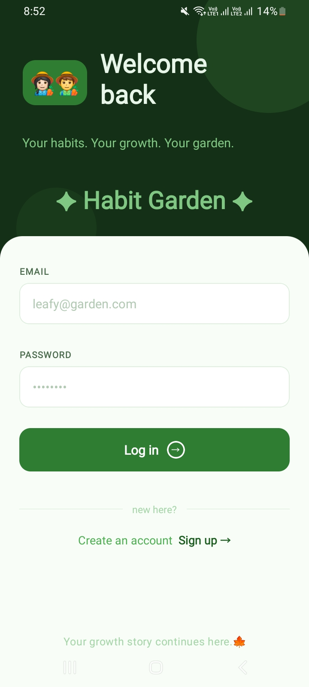
  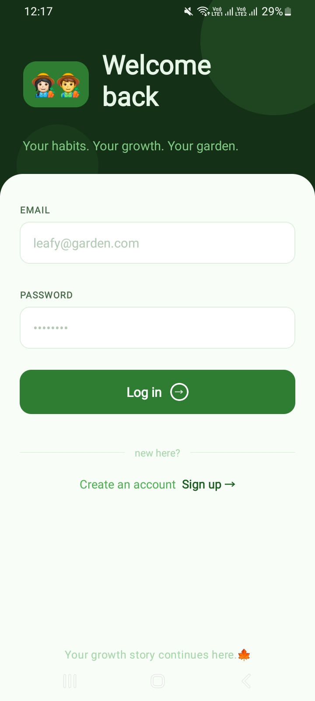
</p>


---

### 🌿 2. Main Garden (Home Screen)

## Night View
<p align="center">
  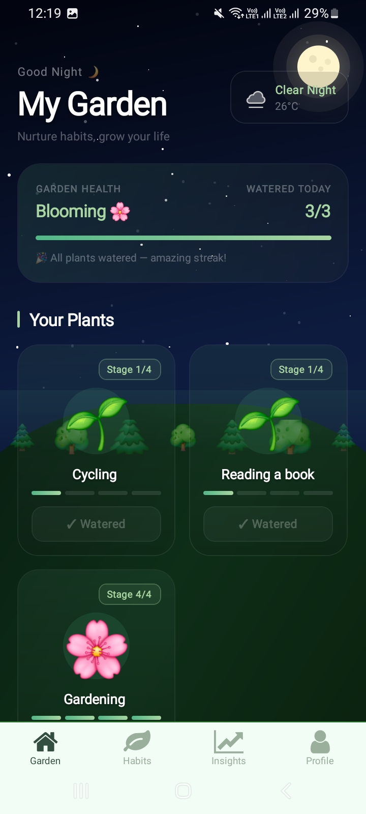
</p>


---

### ➕ 3. Habit Creation Flow


<p align="center">
  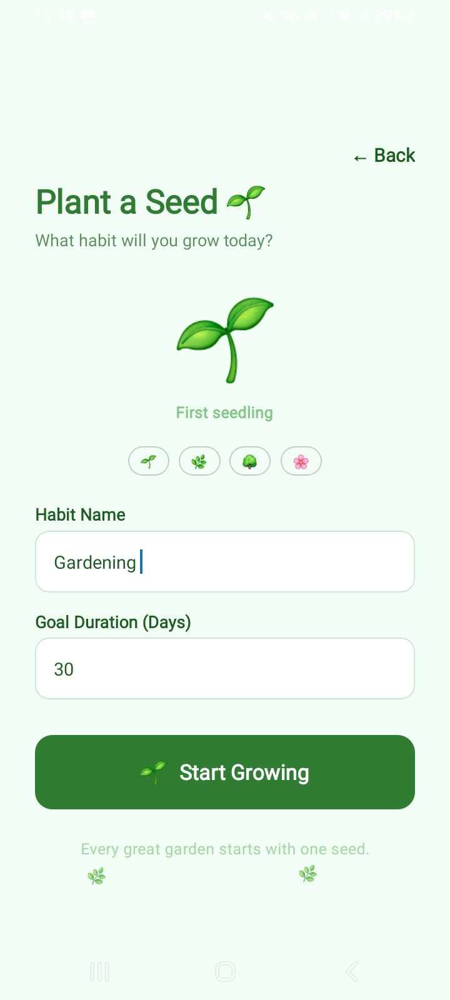
</p>


---

### 📋 4. Habit Tracking Flow


<p align="center">
  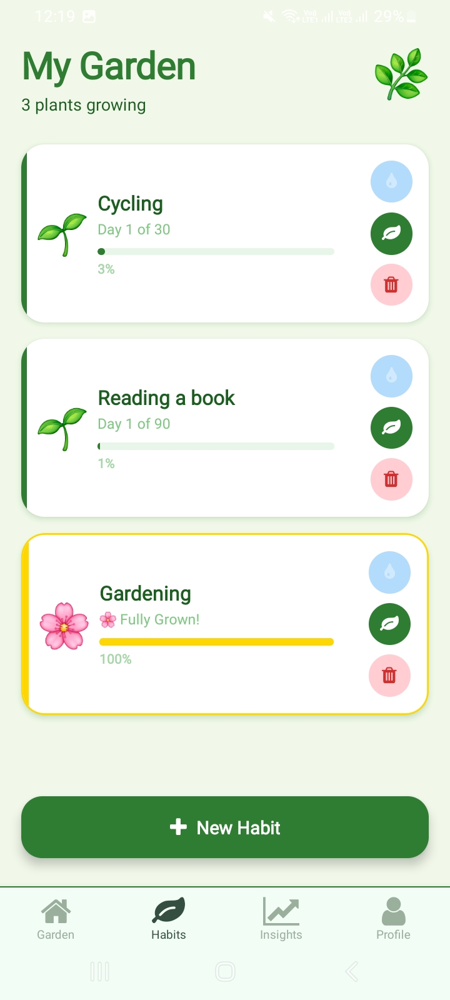
  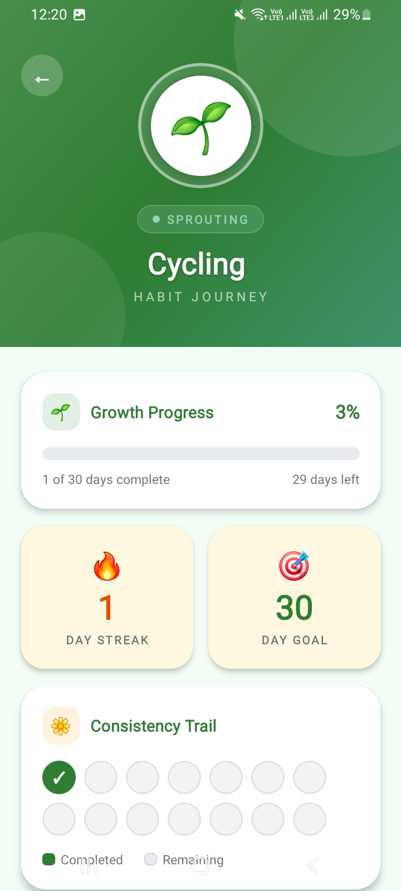
 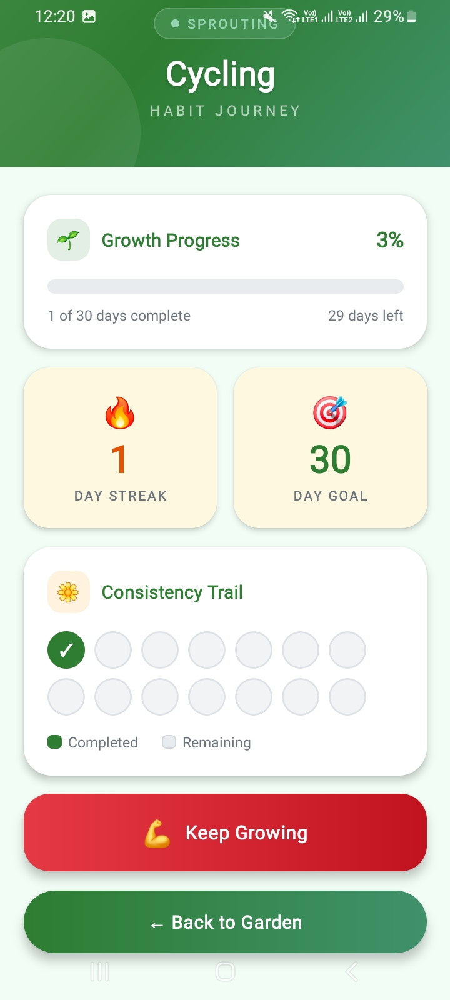
</p>


---

### 📊 5. Stats & Analytics


<p align="center">
  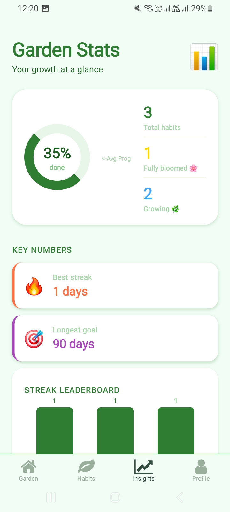
  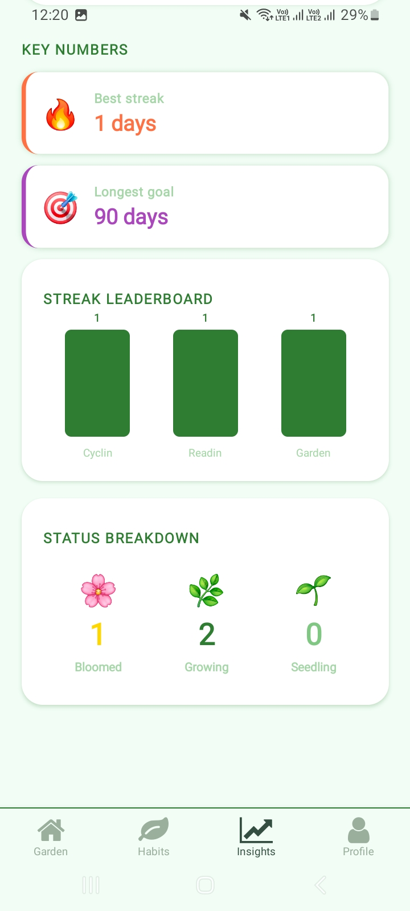
</p>


---

### 👤 6. Profile Screen

<p align="center">
  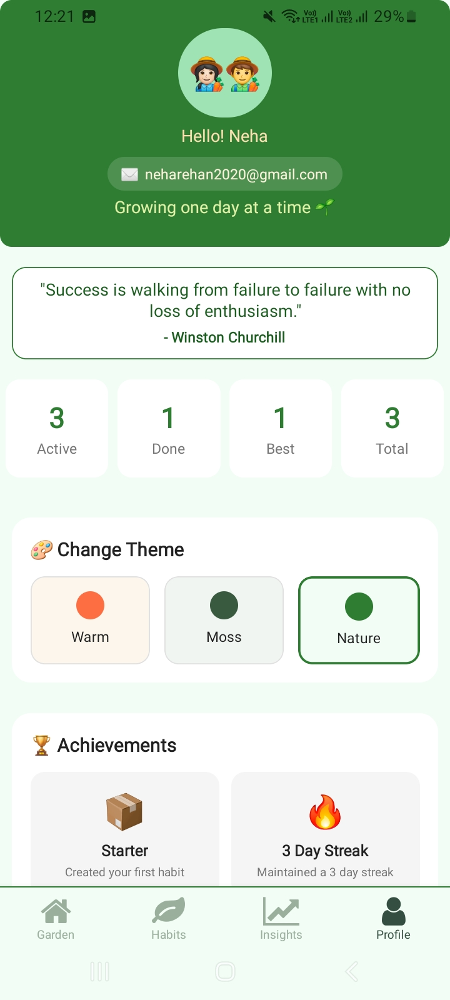
 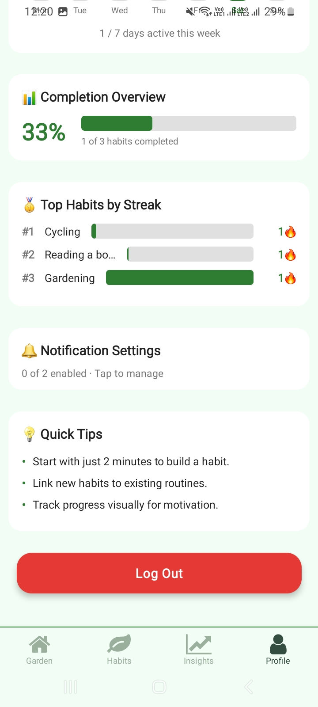
</p>


---


---

## 🔮 Future Enhancements

* 👥 Social sharing & collaboration
* 🌼 Advanced plant evolution system
* 📊 AI-based habit insights

---

## 📌 Project Type

> 🎓 **Academic Project — Mobile Application Development**

---

## 💡 Final Note

HabitBloom turns productivity into a **living, growing experience** — where every small effort contributes to something beautiful 🌸

---

